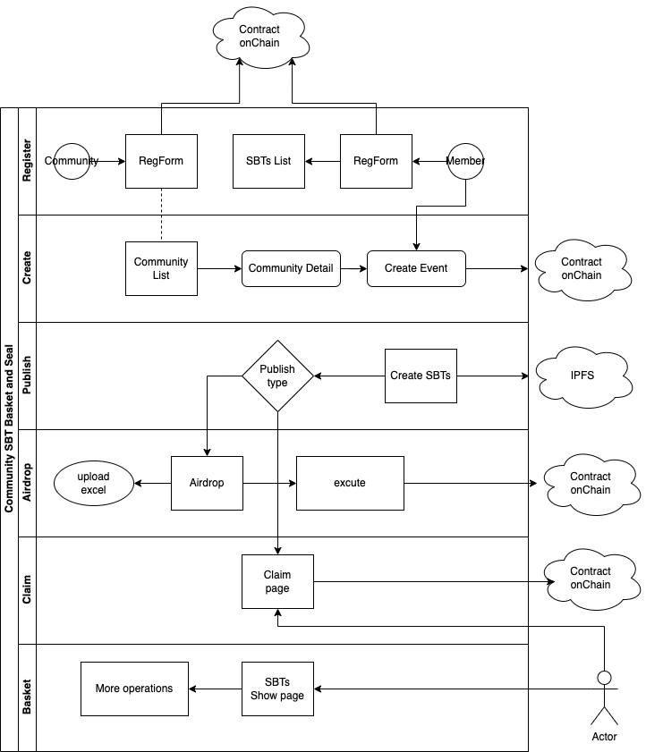
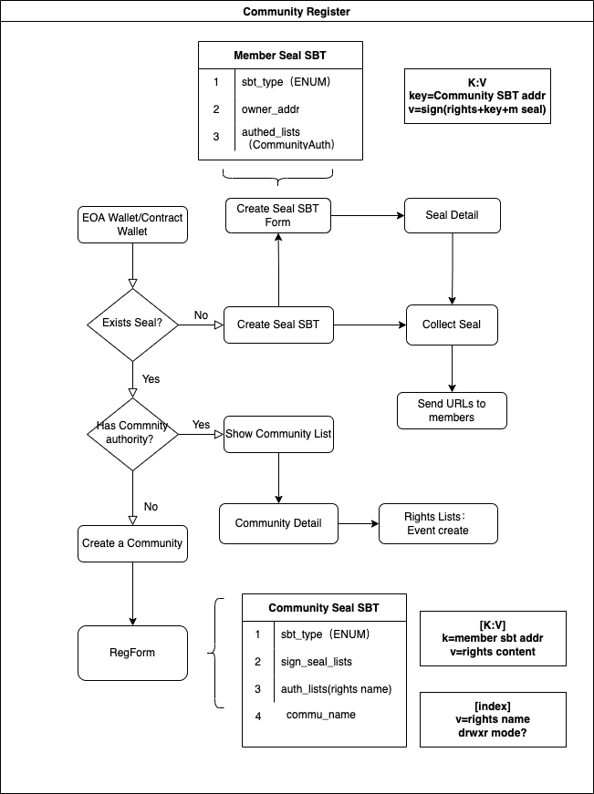

#### 大理Web3大会SBT使用流程初稿方案
0.Based on this doc [design doc](design.md)
zik提产品建议+验收
Pablo验收

1.收集所有干活的Builder的钱包地址和昵称/ID，设定截止日期，不再接受新地址（8-10？，给10天制作时间）。
Pablo，100人-200 NFT，提供excel
大会的slogan？图片？
直接空投Optimism的成本：cejay
Polygon的成本：
zik：想个名字？
大会名称，昵称，角色，时间?

2.制作白名单，只有白名单才可以mint，mint时间宽限到5-7天，不拥堵。
批量mintpolygon，圣洁

3.各工作组统计表单信息（参考github方案字段），其中工时统计需要三个人以上匿名check，给出一个建议调整权重（也可以随心）。
目前空

4.设计SBT的SVG组成部分：（多SVG组合）
图片，转svg，

本次直接空投，显示SBT的界面设计：图片、要素、字段暂停

5.组织注册，领取网址访问
Pablo：706的logo，Plancker，seeDAO，发起的community
Event：Web3街会

Publisher：合约owner，后面加授权

Receiver登录，check是否是白名单，是否已有SBT，有了则显示SBT。

如果不在白名单，则提示联系组委会或者各工作组，并给出dealine提交钱包地址时间。


6.领取后

不可转移，在领取网站可以查看，在opensea可以查看；

traits可以查看；

### SBT开发计划

#### 1.讨论技术方案
hhh，cejay，jhf，海绵，rory，其他有兴趣朋友？


##### 1.1
+ 初始的框架搭建上，然后加hook,rory
+ wagmi+thirdweb+EthShanghai-proofofsoul

##### 1.2简化版Community字段
+ community_name: 社区name
+ community_seal：社区seal，签名用，生成格式待定，就是一个hash，
+ auth_lists:授权签名使用者的列表，默认加入创建人的addr，[addr][777],使用linux的文件权限管理方式，映射表晚点放出+ 来，目前默认有全部权限：777
+ commu_lists: 合约会把创建的所有社区，存入此变量，[seal][name]?还是[name][seal],或者都存上？
+ 关于社区除管理员外的更多成员的注册，加入，授权，本次不管+ 


##### 1.3简化版Event字段
+ URL,image, event_name, community_name, start_time, end_time
+ URL：活动内容（如翻译活动的页面内容），notion，网址等即可
+ image：一张有意义或者代表性的图片，2Mb 以内，进入AR+IPFS，Hash上链
+ event_name: 活动名称20字
+ community_name: 社区名称（registry保存）
+ // community_sign: 点选community进入创建，计算的一个hash（community seal+event name+creator addr）
+ start_time:开始时间，如果只有开始时间，认为是当天结束，必填
+ end_time:结束时间，非必填
+ receiver:参与人（接收人），数组list，存储在IPFS，hash存储在此字段+ 

##### 1.4 Receiver编辑
+ 邀请excel至少三个字段
+ addr：钱包地址
+ nick_name: 参与者昵称
+ role: 活动扮演角色，可多选
+ job：负责工作文字描述，20字文本（可空，非必填）
+ // result_url: 产出结果网址
+ // self_jifen：评估自己的工作量
+ 目前依靠上传Excel，js处理，生成二位数组，存储在IPFS，Hash存储在Event的receiver
+ [0][{addr:0x71FD2974e76fD4b150e65AD6faf46aCF4e16AaC7,nname:jhfnetboy,role:developer, job: build + SBTs system for DaliWeb3}]
+ 同时生成一个key=addr，v=sbtid的kv，提供查询

##### 1.5 Publish发布
+ 导入Excel时选择：
+ airdrop，使用登录的地址支付gas，直接遍历receiver，mint发放SBTs
+ claim，proofofsoul之前方式，需要客户登录指定url，不需要有seal或者任何其他凭证，直接claim
+ claim流程：address查询kv，获得id，申请mint

##### 1.6可选部分
+ 任何人可以创建自己的Seal，加一句自己的格言
+ Seal体系本质上是一个合约钱包+一个不可转移的SBT（Seal），无论对于社区的还是个人的Seal，都可以社交恢复
+ Seal对外会进行签名盖章，表示支持和同意；对于重要的签名，会附加积分
+ 对于任何行为，都可以通过seal来表明自己离场，而离场需要积分来支持才显得有相关性
+ jifen有社区属性，目前不同社区的积分不可互换，但CSBS提供通用积分兑换公式
+ 积分存储于Seal所在的合约钱包
+ 一个社区有多少人支持，可以看被盖章的数量和添加积分的数量
+ 积分需要通过对社区做贡献获取，可以和其他激励机制并行

#### 2.拆分工作量
+ 分工，fork原理SBT，开始开发
+ fork url: [SBT](https://github.com/PlanckerLabs/Dalifunia-SBT)

##### 2.1 合约
+ 合约有社区合约，管理新增社区和社区成员，event合约，管理创建的event和sbt以及接收人
+ 目前两种分发机制，需要在event sbt合约中统一：空投，创建人已有名单，直接mint drop（盲盒中心化发？）；自行claim，只+ 创建元数据，自己mint马上开盒？
+ 1>override 165，不可转移NFT（SBT）
+ 2>图片非原来proofofsoul的上传方式，改为盲盒方式，id先给，用默认图片，开盒图片依靠后面中心化运行脚本赋值？
+ 3>CSBS SBT合约存储Event（Publisher，一个社区hash，必须创建或者拥有），Receiver，未来再赋予更多SBT的属性
+ 4>Community Registry 存在于CSBS Community合约，上面的

##### 2.2 hooks
+ 验证NFT拥有
+ 创建社区
+ 传教活动
+ 上传Excel，生成Receiver列表
+ 空投（盲盒机制待定？）
+ 自行Claim

##### 2.3页面流程
+ 场景交互页面，能看就行，简单简洁

+ 首页，搞个口号：Build together, Record forever! 弄个简单特效
+ https://github.com/robin-dela/hover-effect
+ 用这个特效，图片我放docs/images
```
┌───────────────────────────────────────┐
│                                       │
│                                       │
│                                       │
│                                       │
│                                       │
│   Build together, Record forever!     │
│                                       │
│                                       │
│                                       │
│                                       │
│                                       │
│                                       │
│                                       │
│                                 CSBS  │
└───────────────────────────────────────┘
```
+ Create community ：save onchain or IPFS with json

```
          create community page

┌────────────────────────────────────────┐
│                                        │
│                                        │
│                                        │
│                                        │
│     ┌──────────────┐                   │
│     │community_name│                   │
│     └──────────────┘                   │
│                                        │
│                                        │
│      ┌──────────────┐                  │
│      │community_seal│                  │
│      └──────────────┘                  │   ┌────────────┐
│                                        │   │ommu_lists  │
│                                    ────┼──►│            │
│       ┌──────────────┐                 │   │ onchain    │
│       │  auth_lists  │                 │   └────────────┘
│       └──────────────┘                 │
│                                        │
│                                        │                        ▼
│                                        │
│                     Create button      │
│                                        │
│                                        │
│                                        │
│                                        │
└────────────────────────────────────────┘
```
+ Create event

```
         create event page
┌────────────────────────────────────────┐
│                                        │
│                                        │
│                                        │
│                                        │
│                                        │
│                                        │
│                                        │
│          receiver                      │
│          image,                        │
│          event_name,                   │
│          community_name                │           Event Hash onchain
│           start_time,                ──┼───────►   receiver(hash onchain)
│          end_time                      │
│                                        │             metadata on IPFS
│                                        │
│           upload excel                 │
│                                        │
│                                        │
│                                        │
│                                        │
│                                        │
│                                        │
│                                        │
│                                        │
└────────────────────────────────────────┘
excel至少三个字段
addr：钱包地址
nick_name: 参与者昵称
role: 活动扮演角色，可多个
```
+ 社区列表页（点击进入社区详情，有社区活动link，进入活动列表页）

```
               communities list

┌──────────────────────────────────────────────────────────────┐
│                                                              │
│                                                              │
│                                                              │
│                                                              │
│                                                              │
│   ┌──────────┐         ┌──────────┐      ┌─────────┐         │
│   │          │         │          │      │         │         │
│   │          │         │          │      │         │         │
│   │          │         │          │      │         │         │
│   │          │         │          │      │         │         │
│   └──────────┘         └──────────┘      └─────────┘         │
│                                                            ──┼───►   fetch from hash list of event
│                                                              │
│                                                              │        community_name,seal,creator...
│   ┌───────────┐                                              │
│   │           │         ┌───────────┐      ┌─────────┐       │
│   │           │         │           │      │         │       │
│   │           │         │           │      │         │       │
│   │           │         │           │      │         │       │
│   │           │         │           │      │         │       │
│   └───────────┘         └───────────┘      └─────────┘       │
│                                                              │
│                                                              │
│                                                              │
│                                                              │
│               more...                                        │
│                                                              │
│                                                              │
│                                                              │
│                                                              │
│                                                              │
│                                                              │
│                                                              │
└──────────────────────────────────────────────────────────────┘
```
+ 活动列表页（按社区获取，以及获取所有活动，两个）

```
本次只获取所有活动
fetch from all event contract inner variables
                    event  list

┌──────────────────────────────────────────────────────────────┐
│                                                              │
│                                                              │
│                                                              │
│                                                              │
│                                                              │
│   ┌──────────┐         ┌──────────┐      ┌─────────┐         │
│   │          │         │          │      │         │         │
│   │          │         │          │      │         │         │
│   │          │         │          │      │         │         │
│   │          │         │          │      │         │         │
│   └──────────┘         └──────────┘      └─────────┘         │
│                                                            ──┼───►   fetch from event contract
│                                                              │
│                                                              │
│   ┌───────────┐                                              │
│   │           │         ┌───────────┐      ┌─────────┐       │
│   │           │         │           │      │         │       │
│   │           │         │           │      │         │       │
│   │           │         │           │      │         │       │
│   │           │         │           │      │         │       │
│   └───────────┘         └───────────┘      └─────────┘       │
│                                                              │
│                                                              │
│                                                              │
│                                                              │
│               more...                                        │
│                                                              │
│                                                              │
│                                                              │
│                                                              │
│                                                              │
│                                                              │
│                                                              │
└──────────────────────────────────────────────────────────────┘

```
+ 
+ 任何人，都可以有一个个人SBT列表页，通过addr获得所有活动的sbt

```
my SBT page
┌──────────────────────────────────────────────────────────────┐
│                                                              │
│                                                              │
│                                                              │
│                                                              │
│                                                              │
│   ┌──────────┐         ┌──────────┐      ┌─────────┐         │
│   │          │         │          │      │         │         │
│   │          │         │          │      │         │         │
│   │          │         │          │      │         │         │
│   │          │         │          │      │         │         │
│   └──────────┘         └──────────┘      └─────────┘         │
│                                                            ──┼───►   fetch from event contract
│                                                              │
│                                                              │
│   ┌───────────┐                                              │
│   │           │         ┌───────────┐      ┌─────────┐       │
│   │           │         │           │      │         │       │
│   │           │         │           │      │         │       │
│   │           │         │           │      │         │       │
│   │           │         │           │      │         │       │
│   └───────────┘         └───────────┘      └─────────┘       │
│                                                              │
│                                                              │
│                                                              │
│                                                              │
│               more...                                        │
│                                                              │
│                                                              │
│                                                              │
│                                                              │
│                                                              │
│                                                              │
│                                                              │
└──────────────────────────────────────────────────────────────┘

```

#### 3.两天一次进度review

#### 4.jhf做PM，娃哈哈，提供基础代码（原来的SBT代码）

#### 5.hhh加入页面开发，域名Pablo负责，林可在主页面加SBTs的图片和链接，网址我提供

#### 6.启动
+ 7-30


