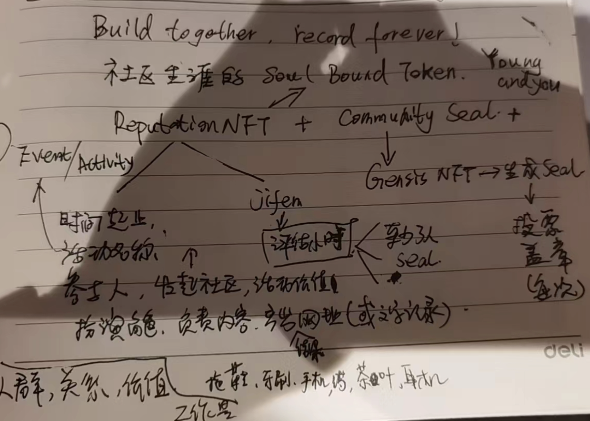

### 产品设计文档
+ 背景信息请看[README](../README.md)
+ GP社区无主题的务虚会议上，大家就这个达成了一些共识：先简单实现工具化，根据反馈，再探讨。
+ zik也给出了一次有价值社区Event的记录：[翻译活动](https://rowan-mollusk-a75.notion.site/Gitcoin-2096ac8093a948f3b7ef30e55d2b6442).
+ 基于这些背景和数据，作出了0.1版本的产品设计。
  #### 定位
+ 产品名称：麦兜取个上口的英文名字吧，中文就翻译下，因为是面向全球的
+ SLOGAN: Build together, record forever!（这些要都大写么？）
+ 基本就透露了定位：Record，记录
#### 使用流程
+ 钱包登录URL： starlink.fish
+ 提供以下内容（活动记录内容）+导入活动参与者的名单（excel，可更改）
+ 提交，gas支付
+ 接受人登录，填写内容，提交，记录上链（IPFS+ERC20分发到SBT关联的account余额）
+ 然后接受NFT（SBT）
+ 完成记录
+ 到大堂hall，查看自己的SBT以及官方的活动记录（NFT？）
#### 活动记录内容
+ URL：活动内容（如翻译活动的页面内容）进入AR+IPFS，Hash上链
+ image：一张有意义或者代表性的图片，2Mb 以内，进入AR+IPFS，Hash上链
+ seal_list：暂空
+ event_name: 活动名称20字
+ event_value:活动的价值描述90字
+ event_id: 在官方服务器的id，可以没有
+ community_name: 社区名称（需要注册，唯一，不可重名）
+ community_seal: 暂空
+ start_time:开始时间，如果只有开始时间，认为是当天结束
+ end_time:结束时间
+ receiver:参与人（接收人），数组

#### 接受者填写内容
+ 需要参与者填写一些活动参与度信息
+ nick_name: 参与者名称
+ role: 活动扮演角色，可多选
+ job：负责工作文字描述，90字文本
+ result_url: 产出结果网址
+ self_jifen：评估自己的工作量

#### SEAL
+ 代表组织或者其他成员对你工作的认可、盖章
+ SEAL暂不开放
+ 
#### 其他
+ 每个社区可以制定自己的积分规则，积分的粒度，如果有自定义标准，建议以文字说明，并提供不可变文档url到SBT。
+ 官方鼓励使用PH方式：以2.5年P6工作能力为基准的对应岗位工作效率衡量积分，1积分等于1小时。
+ 

#### 协议Talk
4973：不可转移，因为是账户绑定，所以可以随时解绑，give+take（drop+claim）
5114: sbt徽章，绑定在NFT上，不可转移（sbt？还是NFT？），不可销毁，tokenUri可自定义
5192: 721增加了一个locked，这个。。。够简洁
CSBS：overide721的transfer，不可转移，drop+claim（give+take），存储于contractwallet，存储后不可转移，私钥丢失可soucial recovery，会有有reputation（seal机制）+quantity（积分体系），这两个可选；有可自定义的taokeUrl+metadata json新增字段；SBT可销毁、取消（revoke），看发行的关联内容（看是关系还是客观记录）

## V0.1 draft design
+ [v0.1-draft](v0.1-draft.md)