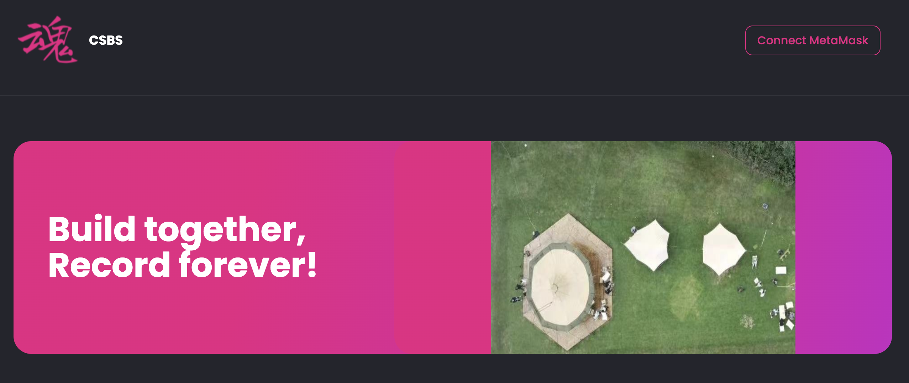
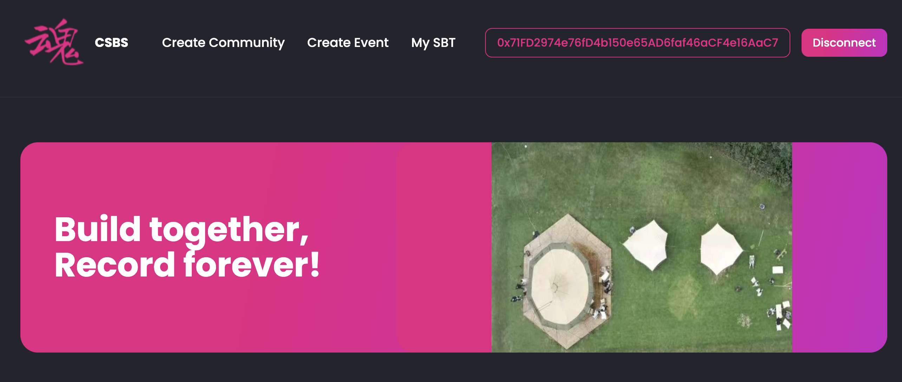
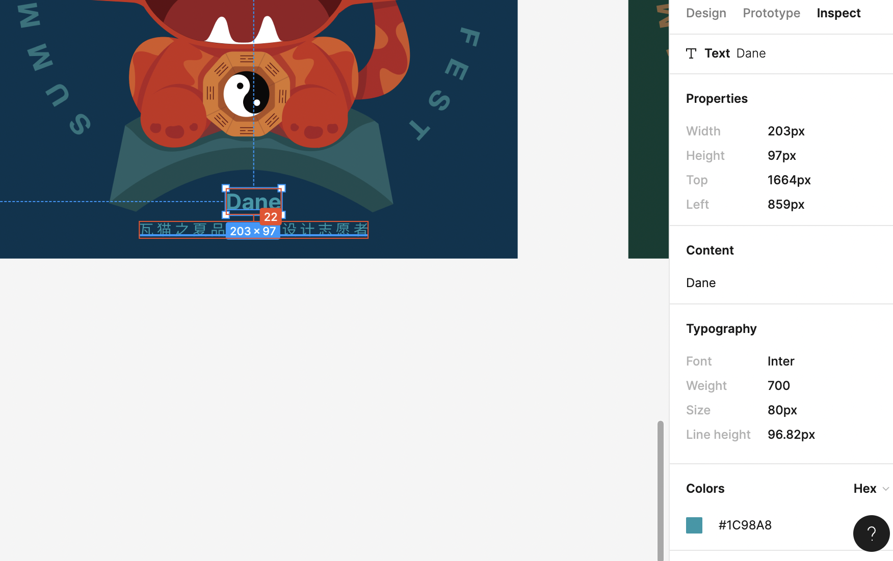

## 背景
+ 9-4周日开发小组进行了一次快速会议
+ 结论：
+ Amagi认领了前端SVG合成任务。
+ 海绵认领了后端excel处理和调用mint任务
+ 周三前会再次沟通，根据jhf提供的0.1版流程，确定方案和分工。
+ 目标是月底前发放SBT给大理大会builder

## 初始化
+ Fork github: https://github.com/PlanckerLabs/CSBS
+ ```yarn install ``` to init
+ ``` yarn start ``` to start
+ View http://localhost:3001/ or 3000
+ See this:
+ 
+ Connect your wallet, see this
+ 

## Flow
+ V0.1的过程如下
+ 1.Root User（管理员）登录，点击，进入Event页面，直接创建Event，实际合约交互建立new Event。
+ 2.创建Event后，基于Event发布Event的SBT，下载[模板](contributors-list.xlsx)，上传批量Mint。
+ 3.前端页面生成空投列表（控制在100个？），根据Excel数据和上传的[SBT图片模板范例]()，生成每人不同的image，并存储在IPFS，返回tokenURI到大数组。
+ 4.然后调用合约的空投函数，Root User支付gas，直接mint到对应地址，无开图直接空投，OpenSea可看。
+ 本次无任何客户体验和交互优化，纯粹给技术管理员用的产品页面流程。

### Create Event @eason
+ Form 方式，调用合约ABI，传入参数
``` {
    "community_name":"Dali Web3",
    "event_name": "Contributors and Builders's Memory",

  } 
```
+ 交互简单直接即可，在Event页面修改吧

### Excel生成 @amagi
+ 必须输入的Excel参数：昵称/ID, 钱包地址
+ 可选输入的Excel参数：角色（限长），例如SBT Dev Group，VI设计师
+ 参数会用来合成唯一的个人SBT图片，以及空投。
+ 范例：瓦猫之夏的前缀和后缀志愿者是由Excel内提供
+ 
+ 

### 合成Image @amagi
+ 调用SVG.js进行图片合成：
+ 
+ 
+ [more infor](https://www.figma.com/file/qSG7ADFs1P55mqttE1NQDw/%E7%93%A6%E7%8C%AB%E4%B9%8B%E5%A4%8FSBT%E8%AE%BE%E8%AE%A1?node-id=0%3A1)
+ Basic picture 
+ 
+ 

+ 参考一个github repo：git@github.com:jhfnetboy/filecoin_nft_starter.git 的BaseSVG.js
+ 或者使用其他方式
+ 合成后存入IPFS，参考本 repo IPFS相关函数：frontend/src/hook/hooks.js (半成品)

### 调用批量Mint @eason
+ 合约提供批量Mint的ABI
+ 入参至少符合721(1155?)标准，另外增加一些traits:
+ community_name
+ Event_name
+ Event_info,什么时间什么人组织了什么活动的文字描述
+ Nick_name
+ Role
+ contribution(在收集，就是一个字符串描述，限长即可)
+ 


